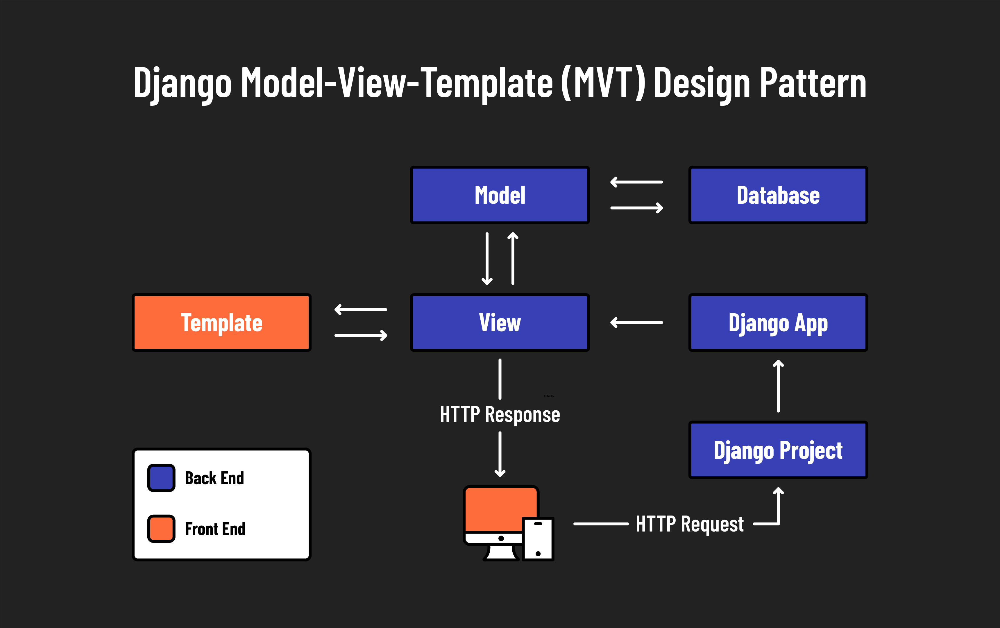

<h1>
  Intro to Django
  Architecture
</h1>

**Learning objective:** By the end of this lesson, learners will be able to describe Django's Model-View-Template (MVT) architecture and differentiate it from the traditional Model-View-Controller (MVC) architecture.

## Django's MVT architecture

Django adopts the Model-View-Template (MVT) architecture, a variant of the more widely known Model-View-Controller (MVC) architecture. While both architectures aim to separate concerns within an application, Django's MVT architecture has distinct roles for each component.

- **Model**: Defines the data structure. These are Python classes that define the fields and behaviors of the data you're storing. Django models can interact with a database seamlessly to retrieve, store, update, and delete data.
- **View**: Handles the business logic and is the bridge between models and templates. In Django, views retrieve data from the models and pass it to the templates. Views in Django perform roles similar to controllers in MVC, essentially directing traffic within the application.
- **Template**: Manages the presentation layer. Templates are HTML files that allow Python-like expressions for dynamic content generation. This separation from the actual business logic in views allows for cleaner, more maintainable code.

## MVC vs Django's MVT

| Concern                   | MVC        | Django MVT |
| ------------------------- | ---------- | ---------- |
| Database access           | Model      | Model      |
| Code mapped to routes     | Controller | View       |
| Rendering of dynamic HTML | View       | Template   |

### Practical implications

When developing with Django, it's essential to adjust the terminology you use:

- `View` in Django corresponds to what is often called `controller` in other MVC frameworks.
- `Template` in Django serves the function of the `view` component in MVC frameworks.

When developing with Django, be careful to say **view** instead of **controller** and **template** instead of **view**.

## Components of a Django project

This diagram illustrates how different components interact within a Django project:

### Terminology in Django

Django uses unique terminology for its components, which can initially be confusing:

- **Project**: In Django, what you might typically think of as a ***web application*** is called a ***project***. This top-level container for your web application houses the configuration and ties everything together.
- **Apps**: What are often considered features or modules in other frameworks are called ***apps*** in Django. An app is a web application that does something such as a blog, a database of public records, or a simple poll app. A project can contain multiple apps, which can be reused in different projects.

A Django ***project*** is a complete website with multiple pages, while a Django ***app*** is a web application that does something specific and can be integrated into any project.

### Understanding Django's project and app structure

| **Component** | **Description**                                                                                                                    |
| ------------- | ---------------------------------------------------------------------------------------------------------------------------------- |
| **Project**   | A full Django project is a complete website containing configurations and applications that make the website function. |
| **Apps**      | Each app is a self-contained package that encapsulates specific functionality or features of a website.                            |

This modular approach makes Django apps highly reusable. They can migrate from one project to another or be maintained across multiple projects.

> 📚 A Django ***project*** can have many ***apps***, and a Django ***app*** can belong to multiple ***projects***.

## Django's routing methodology

Routing is a core aspect of web development, as it determines how a web application responds to a client's request to a particular endpoint, which is a URL path in the web application.

### Comparison with other frameworks

Frameworks like Express and Ruby on Rails define routes using both HTTP methods (GET, POST, etc.) and URL paths, allowing for different responses based on the method used.

Conversely, Django and ASP.NET Core primarily use the URL path to define routes, omitting the HTTP method. This method simplifies routing but may require additional setup to effectively handle multiple HTTP methods for the same URL path.

### Django's routing files

Django's routing is managed through a module named **`urls.py`**, which is found in each app and sometimes at the project level. This module defines the URL patterns (routes) that direct web requests to the correct view functions based on the URL, organizing the routing process across the application.
